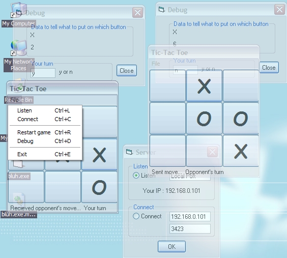



## A Completly Original 2\-player Tic\-Tac Toe Game

### Description

This is a completely original VB 2-player Winsock Tic-Tac Toe game. It has a great interface as you can see by the screenshot. It's partly transparent. This code took my days to make, so please vote for it. Thank you.
 
### More Info
 

             |
---                |---
**Submitted On**   |2001-11-12 18:33:18
**By**             |[Evil Monkey](https://github.com/Planet-Source-Code/PSCIndex/blob/master/ByAuthor/evil-monkey.md)
**Level**          |Advanced
**User Rating**    |4.1 (41 globes from 10 users)
**Compatibility**  |VB 3\.0, VB 4\.0 \(16\-bit\), VB 4\.0 \(32\-bit\), VB 5\.0, VB 6\.0
**Category**       |[Games](https://github.com/Planet-Source-Code/PSCIndex/blob/master/ByCategory/games__1-38.md)
**World**          |[Visual Basic](https://github.com/Planet-Source-Code/PSCIndex/blob/master/ByWorld/visual-basic.md)
**Archive File**   |[A\_Completl3496711122001\.zip](https://github.com/Planet-Source-Code/evil-monkey-a-completly-original-2-player-tic-tac-toe-game__1-28862/archive/master.zip)

